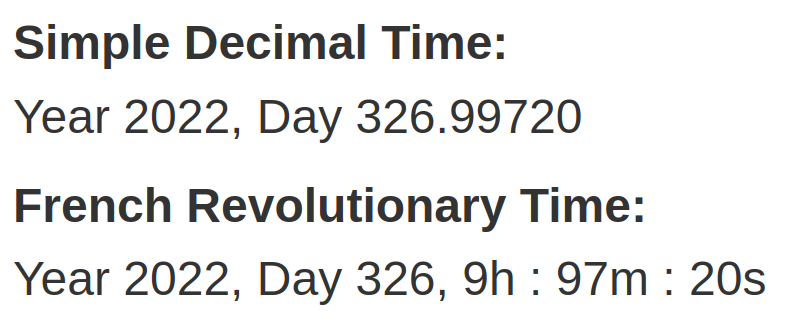

Hack-A-Day is a project I'm doing in November, where I try to make 30 new projects, in 30 days.

# Day 24: Hack-A-Clock

A decimal time clock.

Demo available [here](https://tilde.za3k.com/hackaday/clock).

Source available on [github](https://github.com/za3k/day24_clock).
